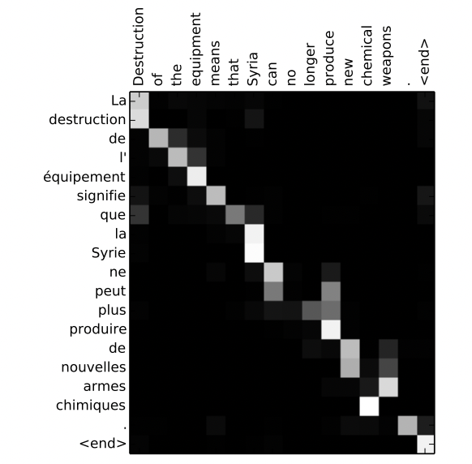
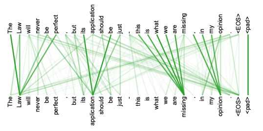

### GPT Transformer
Transformer is a deep learning model that powers the GPT language model. Transformer is a type of neural network that excels at working with texts, much better than recurrent neural networks (RNN).

### RNN vs Transformer
RNNs work sequentially to process text one word at a time, but they are not great at anazlyzing large pieces of text. Since training is sequential, training cannot be done in parallel and is very slow.

Transformers are relatively recent research (2017) from an article called [Attention is All You Need](https://arxiv.org/abs/1706.03762). They process the entire input at once so they are much better at remembering the previous context. They can also be trained in parallel because it processes the entire text instead of one word at a time.

### Transformer Innovations
Transformers introduced two primary new innovations: Positional Encoding & Self Attention.

### Positional Encoding
Instead of dealing with each word sequentially, transformers labels each word (or token) with a position. This is because the order of the words and position in a sentence really matters. The meaning of a sentence can change if the words are re-ordered, so transformers add positional information to the model to retain the information regarding the order of the words.

Example: "Pickes are overrated"

Would position is as: Pickes = 1, are = 2, overrated = 3

Then the positions of each token are passed into the neural network. The neural network will learn the signifiance of the word order from the data.

### Attention
The ability of the neural network to selectively focus on certain parts of input data, while ignoring others. Similar to how humans only focus on certain aspects of the world while ignoring unncessary information. Transformers compute an attention score for each piece of input data, then these scores are used to compute an average of the input elements.

For example this heat map [(from this article)](https://arxiv.org/abs/1409.0473) of translating English to French:

The heatmap shows where the model "attends" to when it outputs each word in the French sentence. For example, the word "Syria" in French is "la Syrie" but the word "la" does not exist in English because we don't say "the Syria" in English grammar. The heat map shows there's strong attention with the words "la" and "Syrie" for the word "Syria" in French.

How does the model "know" which words to "attend" to? It's learned from lots and lots of data, and with enough data it can understand grammar, word order, tenses, etc.

### Self-Attention
This is what makes transformers effective. This is a special form of attention where each element in the input is compared to other elements, and the model sets attention weights based on the similarities between pairs of elements. It is called "self" because it uses the same input data to compare elements within itself.

For example this pairing from "Attention is All You Need" article:

It computes the attention weights for every other word in the sentence. The word "Law" is most strongly correlated with "The", "perfect", and be" in order. GPT uses the concept of self-attention to take the input and apply an appropriate response to each piece of the input.

With enough practice and data, it would learn the basic of grammar and how to connect the words and the meanings behind them. This was how GPT was created.